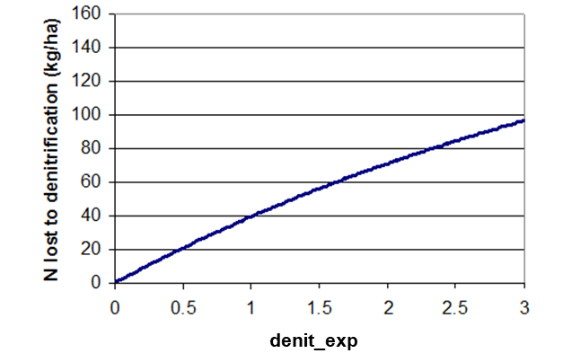

# denit_exp

<!-- Source: https://swatplus.gitbook.io/io-docs/introduction-1/basin-1/parameters.bsn/denit_exp -->

This coefficient allows the user to control the rate of denitrification.

Impact of denit\_exp value on amount of nitrogen lost to denitrification assuming initial nitrate content in layer is 200 kg/ha, temperature of layer is 10ºC, and organic carbon content of layer is 2%.

Last updated 1 year ago
