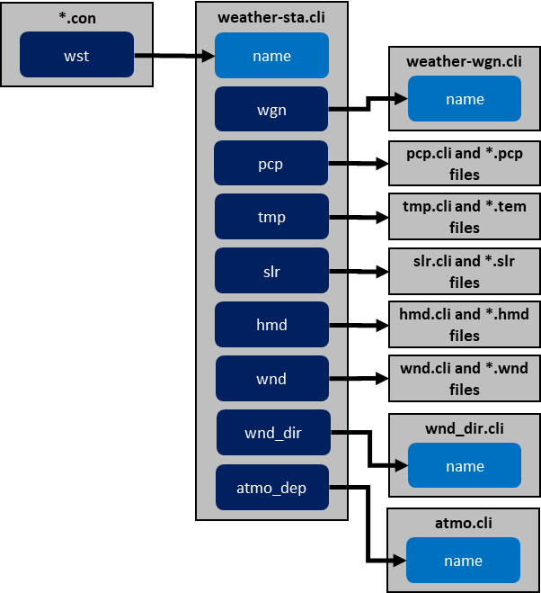

# Climate

<!-- Source: https://swatplus.gitbook.io/io-docs/introduction-1/climate -->

SWAT+ requires daily data for precipitation, maximum and minimum air temperature, solar radiation, relative humidity, and wind speed. The model can read in observed weather data or generate values using the weather generator. Climate data will be generated in two instances: when the user specifies that simulated weather data will be used or when there are missing values in the observed weather data. A Global Weather Generator Database containing weather generator datasets in SWAT+ format for almost 180,000 stations across the globe can be downloaded from the SWAT website: [https://swat.tamu.edu/data/](https://swat.tamu.edu/data/).

If observed data is used, one data file has to be provided for each station and variable. The data files for precipitation, temperature, solar radiation, relative humidity, and wind speed should have the file extensions .pcp, .tem, .slr, .hmd, and .wnd, respectively. The names of all available data files for precipitation, temperature, solar radiation, relative humidity, and wind speed will be listed in [**pcp.cli**](pcp-cli.md), [**tmp.cli**](tmp-cli.md), [**slr.cli**](slr-cli.md), [**hmd.cli**](hmd-cli.md), and [**wnd.cli**](wnd-cli.md), respectively.

Each spatial object in a SWAT+ setup will be assigned the weather stations that are closest to its centroid. Because the precipitation, temperature, solar radiation, relative humidity, and wind speed stations might be at different locations, several combinations of weather stations might be needed for a SWAT+ setup. These combinations will be listed as a record in [**weather-sta.cli**](weather-sta-cli.md). Each of them will be given a unique name, which is referenced by the connect files for the different spatial objects. In addition, the name of the closest weather generator station will be specified, which points to [**weather-wgn.cli**](weather-wgn-cli.md). Finally, the user has the option to specify the name of an atmospheric deposition record, which points to [**atmo.cli**](atmo-cli.md).

There is also a field available for specifying the name of a wind direction data file, but the wind direction routines in SWAT+ are currently not functional and there are no plans to work on them in the foreseeable future.

The flowchart below illustrates the relationships between the different SWAT+ climate files.

Relationships between SWAT+ climate files

Last updated 10 months ago
