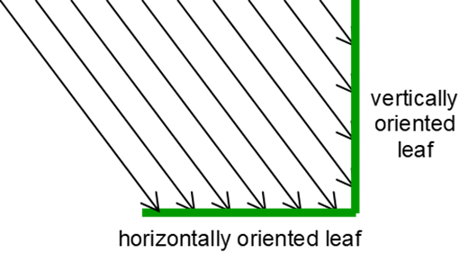

# ext_co

<!-- Source: https://swatplus.gitbook.io/io-docs/introduction-1/databases/plants.plt/ext_co -->

This coefficient is used to calculate the amount of intercepted photosynthetically active radiation.

Differences in canopy structure for a species are described by the number of leaves present (leaf area index) and the leaf orientation. Leaf orientation has a significant impact on light interception and consequently on radiation-use efficiency. More erect leaf types spread the incoming light over a greater leaf area, decreasing the average light intensity intercepted by individual leaves (see figure below). A reduction in light intensity interception by an individual leaf favors a more complete conversion of total canopy-intercepted light energy into biomass.

Using the light extinction coefficient value (kℓ) in the Beer-Lambert formula to quantify efficiency of light interception per unit leaf area index, more erect leaf types have a smaller kℓ.

To calculate the light extinction coefficient, the amount of photosynthetically active radiation (PAR) intercepted and the mass of aboveground biomass (LAI) is measured several times throughout a plant’s growing season using the methodology described in the previous sections. The light extinction coefficient is then calculated using the Beer-Lambert equation:

TPARPAR=(1−exp⁡(−kl⋅LAI))\frac{TPAR}{PAR}=(1-exp⁡(-k\_l⋅LAI))PARTPAR​=(1−exp⁡(−kl​⋅LAI))

or

kl=−ln⁡(TPARPAR)∗1LAIk\_l=-ln⁡(\frac{TPAR}{PAR}) \* \frac{1}{LAI}kl​=−ln⁡(PARTPAR​)∗LAI1​

where *TPAR* is the transmitted photosynthetically active radiation, and *PAR* is the incoming photosynthetically active radiation.

Last updated 1 year ago
