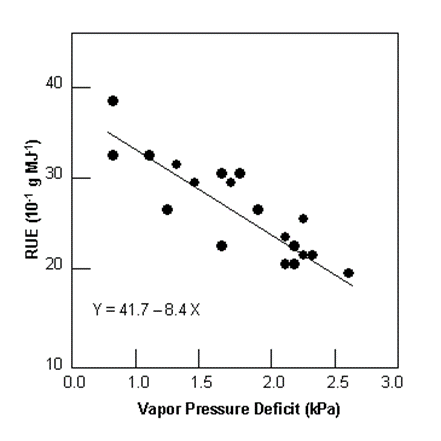

# ru_vpd

<!-- Source: https://swatplus.gitbook.io/io-docs/introduction-1/databases/plants.plt/ru_vpd -->

Stockle and Kiniry (1990) first noticed a relationship between RUE and vapor pressure deficit and were able to explain a large portion of within-species variability in RUE values for sorghum and corn by plotting RUE values as a function of average daily vapor pressure deficit values. Since this first article, a number of other studies have been conducted that support the dependence of RUE on vapor pressure deficit. However, there is still some debate in the scientific community on the validity of this relationship. If the user does not wish to simulate a change in RUE with vapor pressure deficit, the variable *ru\_vpd* can be set to 0.0 for the plant.

To define the impact of vapor pressure deficit on RUE, vapor pressure deficit values must be recorded during the growing seasons that RUE determinations are being made. It is important that the plants are exposed to no other stress than vapor pressure deficit, i.e. plant growth should not be limited by lack of soil water and nutrients.

Vapor pressure deficits can be calculated from relative humidity (see Chapter 1:2 in Theoretical Documentation) or from daily maximum and minimum temperatures using the technique of Diaz and Campbell (1988) as described by Stockle and Kiniry (1990). The change in RUE with vapor pressure deficit is determined by fitting a linear regression for RUE as a function of vapor pressure deficit. The figure below shows a plot of RUE as a function of vapor pressure deficit for grain sorghum.

From the figure, the rate of decline in radiation-use efficiency per unit increase in vapor pressure deficit, Δruedcl, for sorghum is 8.4x10-1 g\*MJ-1\*kPa-1. When RUE is adjusted for vapor pressure deficit, the model assumes the RUE value reported for [bm\_e](untitled-17.md) is the radiation-use efficiency at a vapor pressure deficit of 1 kPa.

#### References

> Campbell (1988)
>
> Stockle & Kiniry (1990)

Last updated 1 year ago
