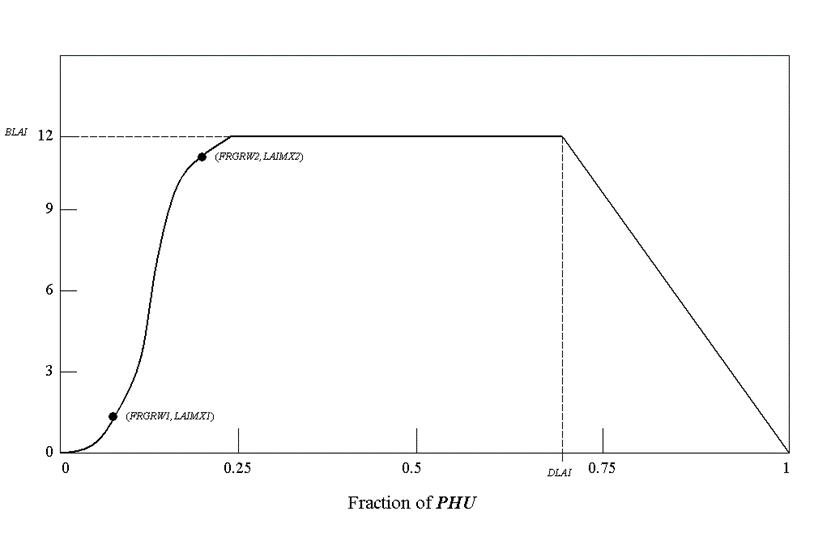

# lai_pot

<!-- Source: https://swatplus.gitbook.io/io-docs/introduction-1/databases/plants.plt/untitled-15 -->

The variable *lai\_pot* is one of six parameters used to quantify leaf area development of a plant species during the growing season. The figure below illustrates the relationship of the database parameters to the leaf area development modeled by SWAT+.

The values for *lai\_pot* in the plant growth database are based on average plant densities in dryland (rainfed) agriculture. The parameter may need to be adjusted for drought-prone regions where planting densities are much smaller or irrigated conditions where densities are much greater.

To identify the leaf area development parameters, record the leaf area index and number of accumulated heat units for the plant species throughout the growing season and then plot the results. For best results, several years worth of field data should be collected. At the very minimum, data for two years is recommended. It is important that the plants undergo no water or nutrient stress during the years in which data is collected.

The leaf area index incorporates information about the plant density, so field experiments should either be set up to reproduce actual plant densities or the maximum LAI value for the plant determined from field experiments should be adjusted to reflect plant densities desired in the simulation. Maximum LAI values in the default database correspond to plant densities associated with rainfed agriculture.

The leaf area index is calculated by dividing the green leaf area by the land area. Because the entire plant must be harvested to determine the leaf area, the field experiment needs to be designed to include enough plants to accommodate all leaf area measurements made during the year.

Although measuring leaf area can be laborious for large samples, there is no intrinsic difficulty in the process. The most common method is to obtain an electronic scanner and feed the harvested green leaves and stems into the scanner. Older methods for estimating leaf area include tracing of the leaves (or weighed subsamples) onto paper, the use of planimeters, the punch disk method of Watson (1958) and the linear dimension method of Duncan and Hesketh (1968).

Chapter 5:1 in the Theoretical Documentation reviews the methodology used to calculate accumulated heat units for a plant at different times of the year as well as determination of the fraction of total, or potential, heat units that is required for the plant database.

#### References

> Watson (1958)
>
> Duncan and Hesketh (1968)

Last updated 1 year ago
