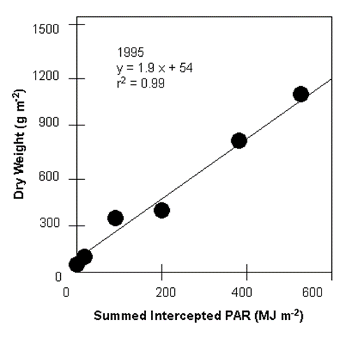

# bm_e

<!-- Source: https://swatplus.gitbook.io/io-docs/introduction-1/databases/plants.plt/untitled-17 -->

The biomass-energy ration or radiation-use efficiency (RUE) is the amount of dry biomass produced per unit intercepted solar radiation. It is assumed to be independent of the plant’s growth stage. The variable *bm\_e* represents the potential or unstressed growth rate (including roots) per unit of intercepted photosynthetically active radiation.

The following overview of the methodology used to measure RUE was summarized from Kiniry et al. (1998) and Kiniry et al. (1999).

To calculate RUE, the amount of photosynthetically active radiation (PAR) intercepted and the mass of aboveground biomass is measured several times throughout a plant’s growing season. The frequency of the measurements taken will vary, but in general 4 to 7 measurements per growing season are considered to be adequate. As with leaf area determinations, the measurements should be performed on non-stressed plants. Intercepted radiation is measured with a light meter. Whole spectrum and PAR sensors are available and calculations of RUE will be performed differently depending on the sensor used. A brief discussion of the difference between whole spectrum and PAR sensors and the difference in calculations is given in Kiniry (1999). The use of a PAR sensor in RUE studies is strongly encouraged.

When measuring radiation, three to five sets of measurements are taken rapidly for each plant plot. A set of measurements consists of 10 measurements above the leaf canopy, 10 below, and 10 more above. The light measurements should be taken between 10:00 am and 2:00 pm local time. The measurements above and below the leaf canopy are averaged and the fraction of intercepted PAR is calculated for the day from the two values. Daily estimates of the fraction of intercepted PAR are determined by linearly interpolating the measured values. The fraction of intercepted PAR is converted to an amount of intercepted PAR using daily values of incident total solar radiation measured with a standard weather station. To convert total incident radiation to total incident PAR, the daily solar radiation values are multiplied by the percent of total radiation that has a wavelength between 400 and 700 mm. This percent usually falls in the range 45 to 55% and is a function of cloud cover. 50% is considered to be a default value. Once daily intercepted PAR values are determined, the total amount of PAR intercepted by the plant is calculated for each date on which biomass was harvested. This is calculated by summing daily intercepted PAR values from the date of seedling emergence to the date of biomass harvest.

To determine biomass production, aboveground biomass is harvested from a known area of land within the plot. The plant material should be dried at least 2 days at 65°C and then weighed.

RUE is determined by fitting a linear regression for aboveground biomass as a function of intercepted PAR. The slope of the line is the RUE. The figure below shows the plots of aboveground biomass and summed intercepted photosynthetically active radiation for Eastern gamagrass. Note that the units for RUE values in the graph, as well as values typically reported in literature, are different from those used by SWAT+. To obtain the value used in SWAT+, multiply by 10.

#### References

> Kiniry et al. (1998)
>
> Kiniry (1999)
>
> Kiniry et al. (1999)

Last updated 1 year ago
