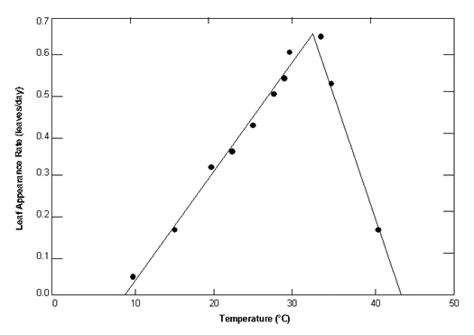

# tmp_opt

<!-- Source: https://swatplus.gitbook.io/io-docs/introduction-1/databases/plants.plt/untitled-6 -->

Both optimal and base temperatures are very stable for cultivars within a species.

Optimal temperature for plant growth is difficult to measure directly. Looking at the figure below, one might be tempted to select the temperature corresponding to the peak of the plot as the optimal temperature. This would not be correct. The peak of the plot defines the optimal temperature for leaf development—not for plant growth.

If an optimal temperature cannot be obtained through a review of literature, use the optimal temperature listed for a plant already in the database with similar growth habits.

Review of temperatures for many different plants have provided generic values for base and optimal temperatures as a function of growing season. In situations, where temperature information is unavailable, these values may be used. For warm season plants, the generic base temperature is ~8ºC and the generic optimal temperature is ~25ºC. For cool season plants, the generic base temperature is ~0ºC and the generic optimal temperature is ~13ºC.

Last updated 1 year ago
