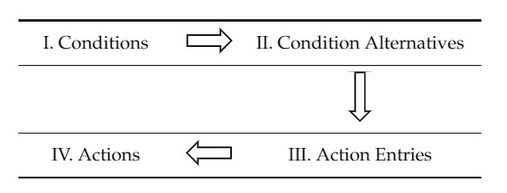

# Decision Tables

<!-- Source: https://swatplus.gitbook.io/io-docs/introduction-1/decision-tables -->

Decision tables are a precise yet compact way to model complex rule sets and their corresponding actions and have been used for many years in data processing and business applications. Using decision tables to simulate management in land, river, and reservoir models was shown to have several advantages over current approaches, including: (1) mature technology with considerable literature and applications; (2) ability to accurately represent complex, real world decision-making; (3) code that is efficient, modular, and easy to maintain; and (4) tables that are easy to maintain, support, and modify.

Decision tables, like flowcharts and if-then-else and switch-case statements, associate conditions with actions to perform, but can do so in a more compact and intuitive way. They are divided into four quadrants: I. Conditions, II. Condition Alternatives, III. Action Entries or Outcomes, and IV. Actions.

The four quadrants of a decision table

#### Quadrant I: Conditions

Quadrant I contains condition variables and condition limits. In addition to the conditional variable, the model must also know its associated watershed object. For example, if reservoir volume is used as the conditional variable, the reservoir ID in the current simulation must be defined. For some condition variables, the limits are defined using a limit variable, limit operator, and limit constant. Using reservoir volume as an example, the principle and emergency volumes could be used as limit variables. An example input would be “emergency volume \* 0.8”. Some condition variables do not have limit variables, e.g., month and Julian day.

#### Quadrant II: Alternatives

There are six possible alternative operators: ">", "<", ">=", "<=", "=", and "-". The alternative is the final piece to construct the “if” statement needed to implement the associated rule. For the symbols ">", "<", and "=", the model will determine if the simulated value of the conditional variable is greater than, smaller than, or equal to the condition limit defined in quadrant I, respectively. The "-" symbol is used if the condition is not relevant for a specific alternative.

#### Quadrant III: Action Entries or Outcomes

Action entries or outcomes specify whether or not an action is triggered. The only options for action entries are yes ("y") and no ("n"). If all conditions specified by an alternative are true and the outcome is "y", then the associated action will be performed. If all conditions specified by an alternative are true but the outcome is "n", the associated action will not be performed.

#### Quadrant IV: Actions

The action type and associated information needed to perform the action are input in quadrant IV. The model must know which watershed object the action is supposed to be performed on. For some actions, there are multiple options to execute the action. Also, further information may need to be specified depending on the action.

There are currently four different types of decision tables available:

- lum.dtl: Land use and management decision tables
- scen\_lu.dtl: Land use change decision tables
- res\_rel.dtl: Reservoir and wetland release decision tables
- flo\_con.dtl: Flow condition decision tables

Last updated 1 year ago
