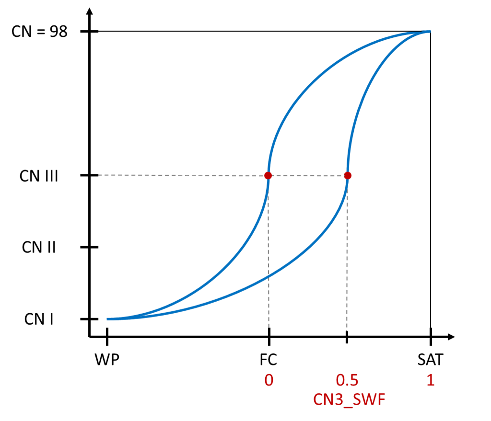

# cn3_swf

<!-- Source: https://swatplus.gitbook.io/io-docs/introduction-1/hydrology/hydrology.hyd/cn3_swf -->

This parameter gives the user control over the level of saturation of the soil that has to be reached before the model switches from using the Curve Number for moisture condition II to moisture condition III. Thus, it can be used to delay the onset of surface runoff after dry periods.

The effect of cn3\_swf on the Curve Number

Last updated 1 year ago
