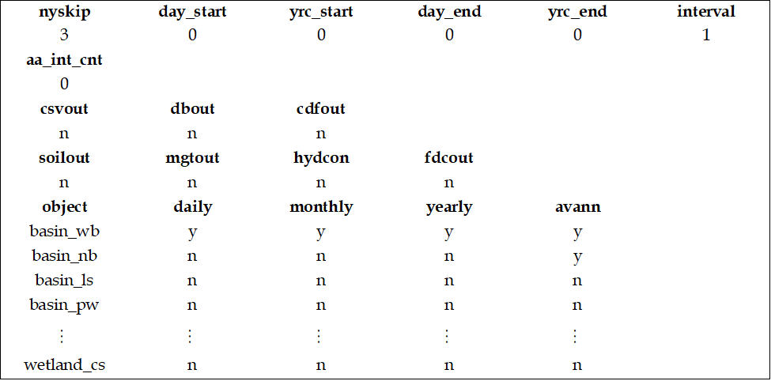

# print.prt

<!-- Source: https://swatplus.gitbook.io/io-docs/introduction-1/simulation-settings/print.prt -->

The **print.prt** file is formatted differently than most other SWAT+ input files (see figure below). In line three, there are several variables for controlling the time period to be printed. In line five, the user can specify the number of print intervals for average annual output. In line seven, the user can select to have output files printed in a specific file format (in addition to the default \*.txt output files). In line 9, the user can control the printing of outputs for soils and management as well as flow duration curves. In lines 11 to 90, there is a list of outputs for different spatial levels and objects that can be printed at daily, monthly, yearly, and average annual time steps. A description of the output files is provided in the [SWAT+ Output Files](../../output-files/output-file-format.md) section.

Format of the print.prt file

| Field                                                                            | Description                                                            | Type    |
| -------------------------------------------------------------------------------- | ---------------------------------------------------------------------- | ------- |
| [nyskip](print.prt/nyskip.md)           | Number of years at the beginning of the simulation to not print output | integer |
| day\_start                                                                       | Julian day to start printing output (for daily printing only)          | integer |
| yrc\_start                                                                       | Calendar year to start printing output                                 | integer |
| day\_end                                                                         | Julian day to stop printing output (for daily printing only)           | integer |
| yrc\_end                                                                         | Calendar year to stop printing output                                  | integer |
| [interval](print.prt/interval.md)       | Print interval within the period                                       | integer |
| [aa\_int\_cnt](print.prt/aa_int_cnt.md) | Number of print intervals for average annual output                    | integer |
| csvout                                                                           | Code for printing output in CSV format (y=yes, n=no)                   | string  |
| dbout                                                                            | Code for printing output in DB format (y=yes, n=no)                    | string  |
| cdfout                                                                           | Code for printing output in Net-CDF format (y=yes, n=no)               | string  |
| crop\_yld                                                                        | Code for printing yearly and average annual crop yields (y=yes, n=no)  | string  |
| mgtout                                                                           | Code for printing management output (y=yes, n=no)                      | string  |
| [hydcon](print.prt/hydcon.md)           | Code for printing hydrograph connection output (y=yes, n=no)           | string  |
| fdcout                                                                           | Code for printing flow duration curve output (y=yes, n=no)             | string  |
| [object](print.prt/object.md)           | Objects that output can be printed for at different time steps         | string  |
| daily                                                                            | Code for printing daily output (y=yes, n=no)                           | string  |
| monthly                                                                          | Code for printing monthly output (y=yes, n=no)                         | string  |
| yearly                                                                           | Code for printing yearly output (y=yes, n=no)                          | string  |
| avann                                                                            | Code for printing average annual output (y=yes, n=no)                  | string  |

Last updated 1 year ago
