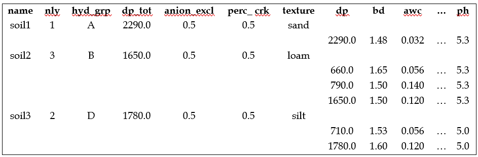

# soils.sol

<!-- Source: https://swatplus.gitbook.io/io-docs/introduction-1/soils/soils.sol -->

The structure of the file **soils.sol** is different than that of most other SWAT+ input files. Depending on the number of soil layers, the file contains two to ten lines per soil. The first line for each soil specifies the variables that apply to the entire soil profile (see first table below). The remaining soil variables are layer-specific and are specified in one line per layer starting one line below the general soil variables (see second table below). The figure below illustrates the structure of a **soils.sol** file with three soils. Please note that due to space restrictions not all layer-specific variables are included.

Example of a soils.sol file with three soils

| Field                                                             | Description                                                                                            | Type    | Unit     | Default | Range |
| ----------------------------------------------------------------- | ------------------------------------------------------------------------------------------------------ | ------- | -------- | ------- | ----- |
| [name](soils.sol/name-soils.sol.md)    | Name of the soil                                                                                       | string  | n/a      |         |       |
| nly                                                               | Number of layers in the soil                                                                           | integer | none     |         |       |
| [hyd\_grp](soils.sol/hyd_grp.md)       | Hydrologic soil group of the soil                                                                      | string  | n/a      |         |       |
| [dp\_tot](soils.sol/dp_tot.md)         | Maximum rooting depth                                                                                  | real    | mm       |         |       |
| [anion\_excl](soils.sol/anion_excl.md) | Fraction of porosity (void space) from which anions are excluded                                       | real    | fraction |         |       |
| [perc\_crk](soils.sol/perc_crk.md)     | Potential or maximum crack volume of the soil profile expressed as a fraction of the total soil volume | real    |          |         |       |
| [texture](soils.sol/texture.md)        | Texture of the soil                                                                                    | string  | n/a      |         |       |

| Field                                                     | Description                                                 | Type | Unit | Default | Range |
| --------------------------------------------------------- | ----------------------------------------------------------- | ---- | ---- | ------- | ----- |
| dp                                                        | Depth from the soil surface to the bottom of the soil layer | real |      |         |       |
| [bd](soils.sol/bd.md)          | Moist bulk density of the soil layer                        | real |      |         |       |
| [awc](soils.sol/awc.md)        | Available water capacity of the soil layer                  | real |      |         |       |
| [soil\_k](soils.sol/soil_k.md) | Saturated hydraulic conductivity of the soil layer          | real |      |         |       |
| [carbon](soils.sol/carbon.md)  | Organic carbon content of the soil layer                    | real |      |         |       |
| [clay](soils.sol/clay.md)      | Clay content of the soil layer                              | real |      |         |       |
| [silt](soils.sol/silt.md)      | Silt content of the soil layer                              | real |      |         |       |
| [sand](soils.sol/sand.md)      | Sand content of the soil layer                              | real |      |         |       |
| [rock](soils.sol/rock.md)      | Rock fragment content of the soil layer                     | real |      |         |       |
| [alb](soils.sol/alb.md)        | Moist soil albedo of the top layer                          | real |      |         |       |
| [usle\_k](soils.sol/usle_k.md) | USLE equation soil erodibility (K) factor of the top layer  | real |      |         |       |
| [ec](soils.sol/ec.md)          | Electrical conductivity of the soil layer                   | real |      |         |       |
| [caco3](soils.sol/caco3.md)    | Calcium carbonate (CaCO3) content of the soil layer         | real |      |         |       |
| [ph](soils.sol/ph.md)          | pH value of the soil layer                                  | real |      |         |       |

Last updated 1 year ago
